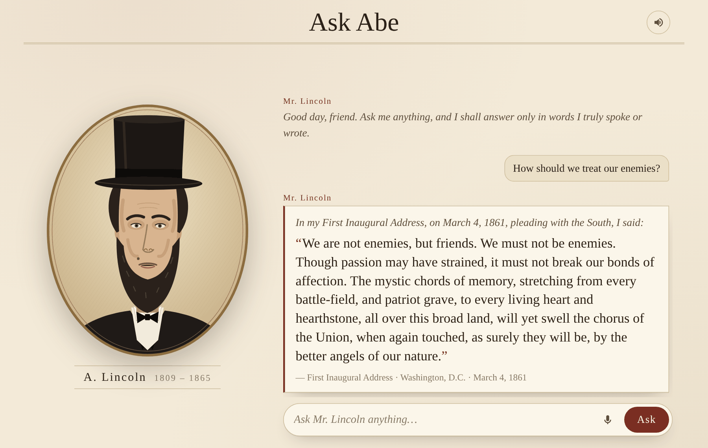

<div align="center">

# Ask Abe

**Ask Abraham Lincoln anything. He answers only with words he actually spoke or wrote.**

[](https://tenzin3.github.io/askabe/)


[**Open the app →**](https://tenzin3.github.io/askabe/)

<a href="https://tenzin3.github.io/askabe/?q=How%20should%20we%20treat%20our%20enemies%3F">
  
</a>

</div>

---

## Why

Most "Lincoln quotes" online are wrong. Some he never said, and others are missing their date and context. AI chatbots make it worse by confidently inventing new ones.

Ask Abe does the opposite. Every answer is a **verbatim passage** from Lincoln's speeches, letters and messages, shown with **where and when** he said it. If nothing on record fits your question, he tells you so instead of making something up.

## Try these

| Ask | He answers from |
|---|---|
| [How should we treat our enemies?](https://tenzin3.github.io/askabe/?q=How%20should%20we%20treat%20our%20enemies%3F) | First Inaugural Address, 1861 |
| [What is democracy?](https://tenzin3.github.io/askabe/?q=What%20is%20democracy%3F) | Fragment on Democracy, c. 1858 |
| [How do I deal with grief?](https://tenzin3.github.io/askabe/?q=How%20do%20I%20deal%20with%20grief%3F) | Letter to Fanny McCullough, 1862 |
| [Is it ok to lie?](https://tenzin3.github.io/askabe/?q=Is%20it%20ok%20to%20lie%3F) | Notes for a Law Lecture, c. 1850 |
| [What did you believe about race?](https://tenzin3.github.io/askabe/?q=What%20did%20you%20believe%20about%20race%3F) | Charleston debate, 1858, and his last speech, 1865 |

Any question works as a link: `https://tenzin3.github.io/askabe/?q=your question`.

## Features

- 🎩 **Animated portrait.** An original SVG illustration that blinks, sways and moves its mouth as he speaks.
- 🔊 **Talks back.** Answers are read aloud with your browser's built-in voice. You can turn it off.
- 🎙️ **Ask out loud.** Voice questions work in Chrome, Edge and Safari.
- 📜 **Sourced answers.** Each answer shows the work, the place and the date.
- 🚫 **No made-up quotes.** Unmatched questions get an honest "nothing on record" reply.
- 📱 **Built for phones too.** A full-screen chat layout with the portrait always in view, plus light and dark mode.
- 💸 **Free to run.** Everything happens in the browser, with no server, database or API key.

## How it works

```
your question
     │
     ▼
in-browser search (BM25 over quote text, titles and topic tags, with synonyms)
     │
     ├── no good match ──► "I find nothing in my speeches or letters on that…"
     │
     ▼
best passage ──► lead-in + verbatim quote + source card
     │
     ▼
Web Speech API reads it aloud ──► portrait's mouth animates in time
```

One rule keeps it honest: **the quotation is always verbatim**. The short italic lead-in before it (for example, *"At Gettysburg, on November 19, 1863, I said:"*) is written by the app, and the page says so.

## The quotes

[`data/lincoln.json`](data/lincoln.json) holds **53 hand-picked passages** (1832–1865) from *The Collected Works of Abraham Lincoln*, which is in the public domain. They cover the Union, liberty, slavery, the war, democracy, faith, work, honesty, grief and more.

Sourcing principles:

- **Verbatim text with dates and places** for every passage.
- **No sanitizing.** His 1858 remarks against racial equality are included, alongside his 1865 support for voting rights for some Black men, with a note on how his views changed.
- **No famous fakes.** Lines like *"You can fool all the people some of the time…"* are left out because no reliable source ties them to him.

<details>
<summary>Data format</summary>

| field | meaning |
|---|---|
| `text` | the verbatim quotation |
| `work`, `kind` | e.g. "Gettysburg Address"; `speech`, `letter`, `debate`, `message`, `writing` or `proclamation` |
| `date`, `date_precision` | ISO date; `approximate` for undated notes |
| `place` | where it was said or written |
| `intro` | the app's lead-in line (not a quotation) |
| `topics` | tags that help match everyday questions |
| `note` | optional historical context |

</details>

### Add more quotes from Wikiquote

Run the **Collect Wikiquote quotes** workflow from the repo's **Actions** tab, or run it locally:

```bash
pip install requests beautifulsoup4
python scripts/collect_wikiquote.py --page Abraham_Lincoln --out data/wikiquote_lincoln.json
```

The app merges `data/wikiquote_lincoln.json` automatically, skips duplicates and credits Wikiquote (CC BY-SA 4.0). The collector ignores Wikiquote's "Disputed", "Misattributed" and "Quotes about" sections.

## Run it locally

Browsers won't load the quote file from a double-clicked `index.html`, so start a tiny local server:

```bash
git clone https://github.com/tenzin3/askabe.git
cd askabe
python3 -m http.server 8000
```

Then open <http://localhost:8000>.

## Deploy (free, on GitHub Pages)

The live site is **https://tenzin3.github.io/askabe/**. To deploy your own copy:

1. Go to **Settings → Pages → Build and deployment**.
2. Set **Source** to **GitHub Actions**. The included [`pages.yml`](.github/workflows/pages.yml) publishes the site on every push to `main`.

You can use **Deploy from a branch** (`main`, `/ (root)`) instead, but then delete `.github/workflows/pages.yml` so it doesn't fail on each push.

## Project layout

```
index.html                     page and inline SVG portrait
css/style.css                  styles (light and dark)
js/app.js                      question → answer flow, transcript, mic
js/search.js                   in-browser BM25 search
js/avatar.js                   blinking, swaying, lip movement
js/voice.js                    text-to-speech
data/lincoln.json              curated quotes
scripts/collect_wikiquote.py   Wikiquote collector
.github/workflows/             Pages deploy and quote collection
docs/screenshot.png            README image
```

## Browser support

| | Chrome / Edge | Safari | Firefox |
|---|:-:|:-:|:-:|
| Ask by typing | ✅ | ✅ | ✅ |
| Spoken answers | ✅ | ✅ | ✅ |
| Ask by voice | ✅ | ✅ | — |

Voices come from your operating system, so Lincoln sounds a little different on each device.

## Roadmap

- [ ] Semantic search with [transformers.js](https://huggingface.co/docs/transformers.js) embeddings, still with no server
- [ ] More voices from history: Mark Twain, Frederick Douglass, Benjamin Franklin
- [ ] Debate mode: two figures answer the same question
- [ ] Quote checker: paste a "Lincoln quote" and see whether it's on the record

## Credits

- Quotations: *The Collected Works of Abraham Lincoln*, ed. Roy P. Basler (1953), public domain. Optional extra quotes from [Wikiquote](https://en.wikiquote.org/wiki/Abraham_Lincoln) (CC BY-SA 4.0).
- Portrait: an original illustration made for this project.
- Not affiliated with any museum, library or government body.
